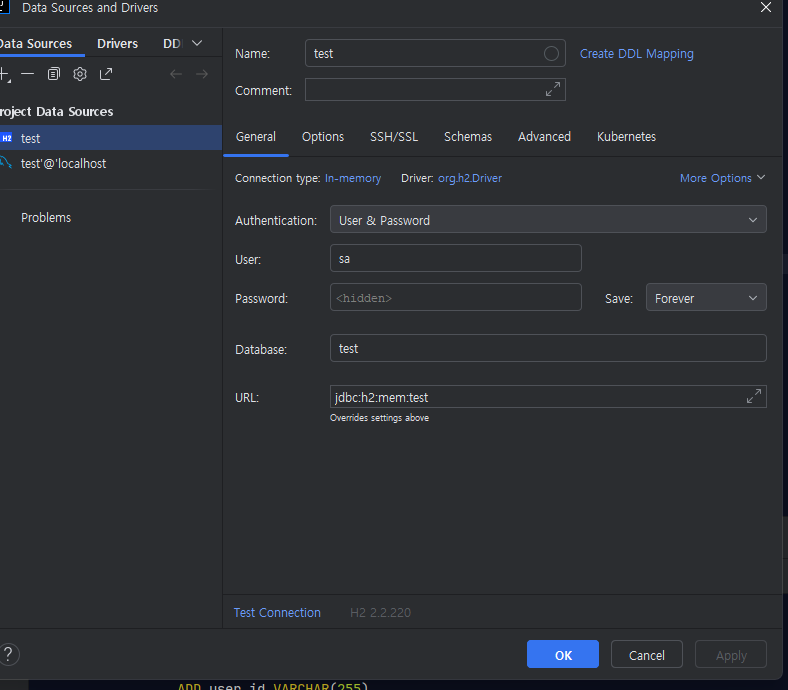

```sql
-- auto-generated definition
create table TB_USER
(
ADDRESS     CHARACTER VARYING(255),
CREATE_DATE TIMESTAMP,
IDX         BIGINT auto_increment,
UPDATE_DATE TIMESTAMP,
USER_ID     CHARACTER VARYING(255),
USER_PW     CHARACTER VARYING(255),
constraint PK_TB_USER
primary key (IDX)
);
```

## H2 설치.
1. `https://www.h2database.com/html/main.html`
2. 자바 환경변수 등록 돼있는지 확인. cmd켜서 `javac -version`
3. h2 console 설치. 
4. h2 콘솔 실행시키면 브라우저에 h2콘솔이 뜸.
5. h2 console에서 embeded에서 유저 sa로 하고 비번 설정 하지말고 JDBD url만 `jdbc:h2:mem:test`로 입력 하고 connect 누르기. 이후엔 세팅을 (Server)로 바꿔주고 커넥하면됨.

## 인텔리제이에서 사용하기

1. 설정에서 database navigator 설치. ide 재시작.
2. 좌측에 DB Browser 아이콘 생겼을거임 그거 누르고 `+` 누르고 custom 누르면 창 뜸.
3. h2 설정하기
   - Connection url : jdbc:h2:mem:test
   - User : sa
   - Driver library : C:\Program Files (x86)\H2\bin 
        `드라이버 라이브러리 등록하면 밑에 드라이버칸에 org.h2.driver 자동 입력 될거임`
   - Test Connection 누르고 authentication user 로 바꾸고 sa 확인하고 apply -> 확인 누르면 됨
4. 디비 연결은 했지만 테이블이 없을거임. main.resources 폴더 하위에 db.migration 폴더에 v2 sql파일 있을텐데, 그 파일 돌려보면 테이블 생성댐


## ref :
[h2 클래스패스](https://h2database.com/html/features.html?highlight=AUTO_SERVER&search=auto_server#firstFound)
