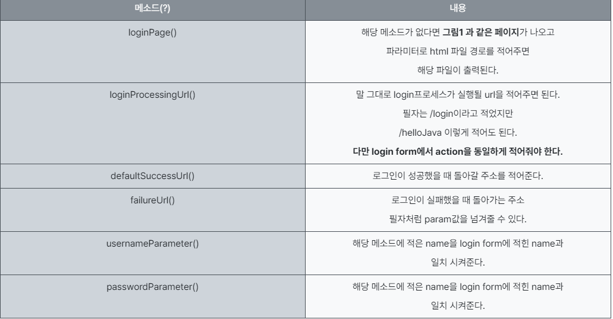
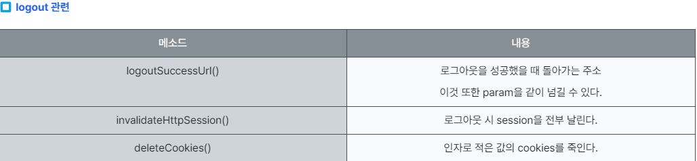

# security filter


- SecurityContextPersistenceFilter
  - SecurityContextRepository에서 SecurityContext(접근 주체와 인증에 대한 정보를 담고 있는 객체)를 가져오거나 저장하는 역할
- LogoutFilter	
  - 설정된 로그아웃 URL로 오는 요청을 확인해 해당 사용자를 로그아웃 처리 함
- UsernamePasswordAuthenticationFilter
  - 인증 관리자. 폼 기반 로그인 시 사용되는 필터로 아이디, 패스워드 데이터를 파싱하여 인증 요청을 위임. 인증이 성공하면 AuthenticationSuccessHandler, 실패하면 AuthenticationFailureHandler를 실행
- DefaultLoginPageGeneratingFilter
  - 사용자가 로그인 페이지를 따로 지정하지 않았을 때 기본으로 설정하는 로그인 페이지 관련 필터
- BasicAuthenticationFilter
  - 요청 헤더에 있는 아이디와 패스워드를 파싱해 인증 요청 위임. 인증이 성공하면 AuthenticationSuccessHandler를, 인증에 실패하면 AuthenticationFailureHandler 실행
- RequestCacheAwareFilter
  - 로그인 성공 후, 관련 있는 캐시 요청이 있는지 확인하고 캐시 요청 처리.
- SecurityContextHolderAwareRequestFilter
  - HttpServletRequest 정보를 감싼다. 필터 체인 상의 다음 필터들에게 부가 정보를 제공함.
- AnonymousAuthenticationFilter
  - 필터가 호출되는 시점까지 인증되지 않았다면 익명 사용자 전용 객체인 AnonymousAuthentication을 만들어 SecurityContext에 넣어준다.
- SessionManagementFilter
  - 인증된 사용자와 관련된 세션 작업 진행. 세션 번조 방지 전략 설정, 유효하지 않은 세션에 대한 처리, 세션 생성 전략을 세우는 등의 작업 처리
- ExceptionTranslationFilter
  - 요청을 처리하는 중에 발생할 수 있는 예외를 위임하거나 전달
- vFilterSecurityInterceptor
  - 접근 결정 관리자. AccessDecisionManager로 권한 부여 처리를 위임함으로써 접근 제어 결정을 쉽게 해준다. 이 과정에서 이미 사용자 인증이 되어있으므로 유효한 사용자인지도 알 수 있음. 인가 관련 설정 가능.


# UserDetails
- getAuthorities()	
  - 사용자가 가지고 있는 권한 목록 반환.
- getUsername()	
  - 사용자를 식별할 수 있는 사용자 이름 반환. 사용되는 값은 반드시 고유해야 함.
- getPassword()	
  - 사용자의 비밀번호 반환. 반드시 암호화해서 저장
- isAccountNonExpired()	
  - 계정이 만료되었는지 확인. 만료되지 않았을 시 true 반환
- isAccountNonLoked()	
  - 계정이 잠금되었는지 확인. 잠금되지 않았을 시 true 반환
- isCredentialsNonExpired()	
  - 비밀번호가 만료되었는지 확인. 만료되지 않았을 시 true 반환
- visEnabled()	
  - 계정이 사용 가능한지 확인. 사용 가능할 시 true 반환

# CSRF filter

`http.headers(AbstractHttpConfigurer::disable)`
`http.csrf(AbstractHttpConfigurer::disable)`

# FormLogin filter



- formLogin() // form 로그인 인증 기능이 작동함
- .loginPage("/loginPage") // 사용자 정의 로그인 페이지, default: /login
- .defaultSuccessUrl("/") // 로그인 성공 후 이동 페이지
- .failureUrl("/login") // 로그인 실패 후 이동 페이지
- .usernameParameter("userId") // 아이디 파라미터명 설정, default: username
- .passwordParameter("passwd") // 패스워드 파라미터명 설정, default: password
- .loginProcessingUrl("/login_proc") // 로그인 Form Action Url, default: /login
- .successHandler( ...생략... ) // 로그인 성공 후 핸들러
- .failureHandler( ...생략... ) // 로그인 실패 후 핸들러
- .permitAll(); // loginPage 접근은 인증 없이 접근 가능

## defaultSuccessUrl
defaultSuccessUrl 은 로그인 성공 후에 이동할 경로를 정해주는 것
우선순위는 가장 마지막

## authorizeRequests

role이 여러 개가 아니라 user 하나만 있다면 authenticated()를 사용해도 된다.
- authenticated() - 인증된 사용자의 접근을 허용
- permitAll() - 무조건 허용
- denyAll() - 무조건 차단
- anonymous() - 익명 사용자 허용
- hasRole(String) - 사용자가 주어진 역할이 있다면 접근을 허용
- hasAnyRole(String, ...) - 사용자가 주어진 역할 중 하나라도 있다면 허용

## configureGlobal
로그인 기능을 구현하려면 AuthenticationManagerBuilder를 받아 인증 처리를 해야한다.
위에서 사용하는 userDetailsService는 타입이 UserDetailsService로 어떤 기준으로 로그인 처리를 할지에 대한 정보
를 설정해줘야 한다. 또한 주입받아서 사용하고 있음을 확인할 수 있다.

## Role

- role을 그냥 USER라고 해두면 security에서 인식을 하지 못하기 때문에 꼭 "ROLE_" 을 포함시켜줘야 한다.
- role을 생성했다면 member entity에도 role을 추가해줘야 한다.

## thymeleaf

```html
 <div sec:authorize="hasRole('USER')">
        <h2 sec:authentication="name">사용자</h2>
        <a href="/member/list">회원목록</a>
        <a href="/logout">로그아웃</a>
    </div>
    <div sec:authorize="!hasRole('USER')">
        <div th:if="${param.logout}">
            로그아웃 하셨습니다.
        </div>
        <a href="/login">로그인</a>
    </div>
```


# Spring Security + Thymeleaf 태그

---
```html
<!-- 인증되지 않은(로그인하지 않은) 사용자에게 보임 -->
<button sec:authorize="isAnonymous()" type="button" onclick="location.href='/admin/loginView'">로그인</button>
<!-- 인증된(로그인한) 사용자에게 보임 -->
<button sec:authorize="isAuthenticated()" type="button" onclick="location.href='/admin/logout'">로그아웃</button>

<!-- ROLE_ADMIN 권한을 가지고 있다면 보임 -->
<div sec:authorize="hasRole('ADMIN')">ROLE_ADMIN 권한이 있습니다.</div>
<!-- ROLE_SUB_ADMIN 권한을 가지고 있다면 보임 -->
<div sec:authorize="hasRole('SUB_ADMIN')">ROLE_SUB_ADMIN 권한이 있습니다.</div>
<!-- ROLE_USER 권한을 가지고 있다면 보임 -->
<div sec:authorize="hasRole('USER')">ROLE_USER 권한이 있습니다.</div>
<!-- ROLE_ADMIN 혹은 ROLE_SUB_ADMIN 권한을 가지고 있다면 보임 -->
<div sec:authorize="hasAnyRole('ADMIN, SUB_ADMIN')">ROLE_ADMIN 혹은 ROLE_SUB_ADMIN 권한이 있습니다.</div>

<br/>
<!--인증시 사용된 객체에 대한 정보-->
<b>Authenticated DTO:</b>
<div sec:authorize="isAuthenticated()" sec:authentication="principal"></div>

<br/>
<!--인증시 사용된 객체의 Username (ID)-->
<b>Authenticated username:</b>
<div sec:authorize="isAuthenticated()" sec:authentication="name"></div>

<br/>
<!--객체의 권한-->
<b>Authenticated admin role:</b>
<div sec:authorize="isAuthenticated()" sec:authentication="principal.authorities"></div>
```

## button th:onclick으로 페이지 이동

- `<input type="button" th:onclick="|location.href='@{join}'|" value="회원가입" id="join">`
- `<input type="button" th:onclick="|location.href='@{/}'|">` 인덱스 첫 페이지 이동.
- `<input type="button" th:onclick="|location.href='@{이동할 url}'|"> `


# JWT

[Spring Security - 인증과 인가 : 정보 저장](https://chaeyami.tistory.com/251)
[SecurityContextHolder 이용하여 로그인 정보 가져오기](https://januaryman.tistory.com/165)