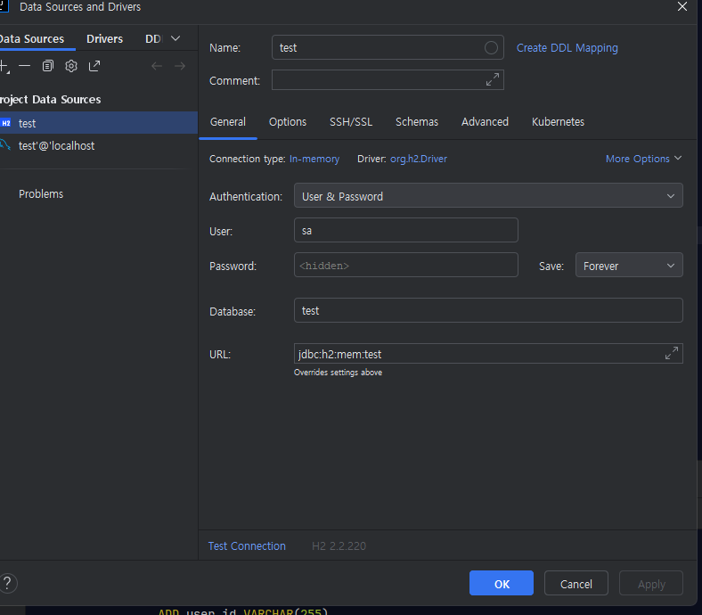

```sql
-- auto-generated definition
create table TB_USER
(
ADDRESS     CHARACTER VARYING(255),
CREATE_DATE TIMESTAMP,
IDX         BIGINT auto_increment,
UPDATE_DATE TIMESTAMP,
USER_ID     CHARACTER VARYING(255),
USER_PW     CHARACTER VARYING(255),
constraint PK_TB_USER
primary key (IDX)
);
```